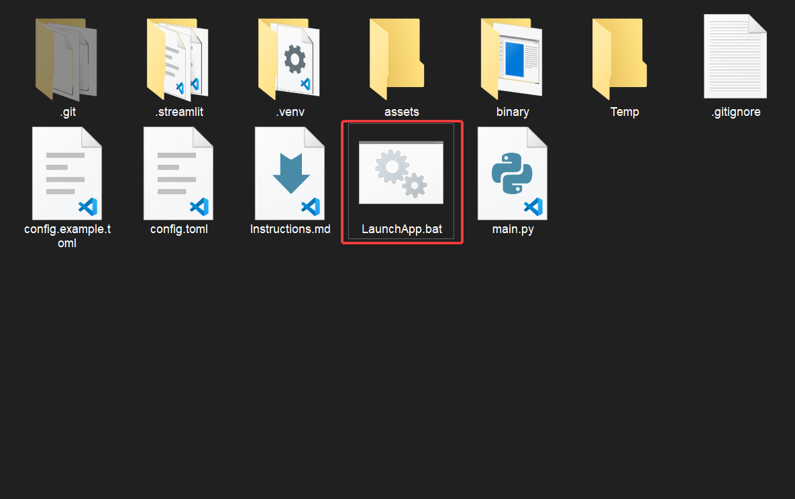
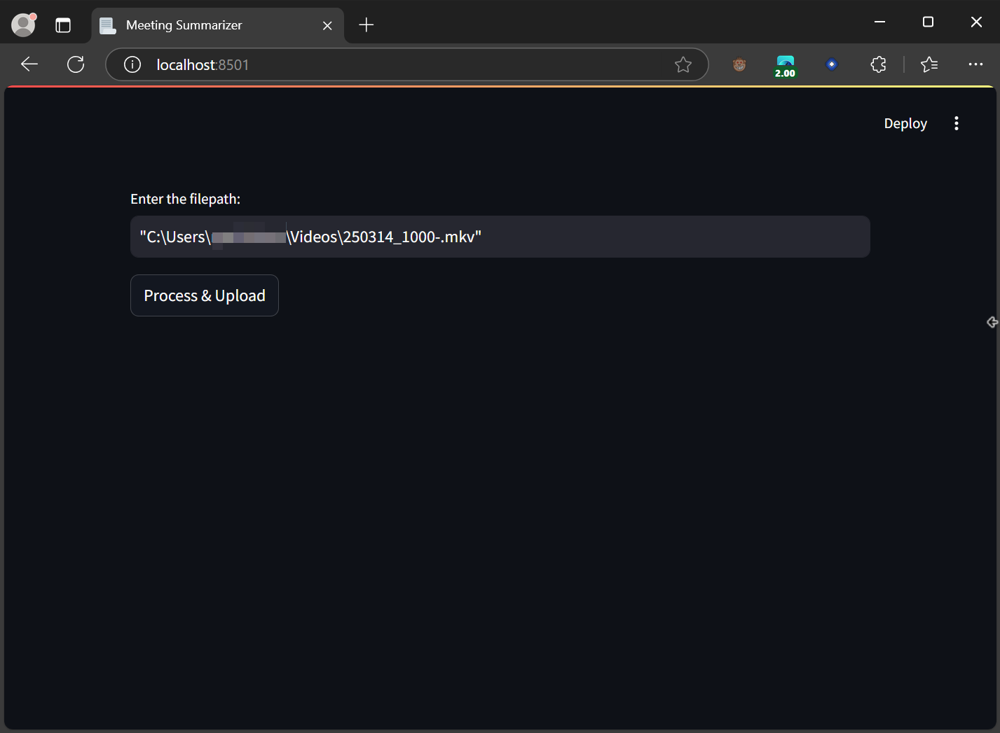
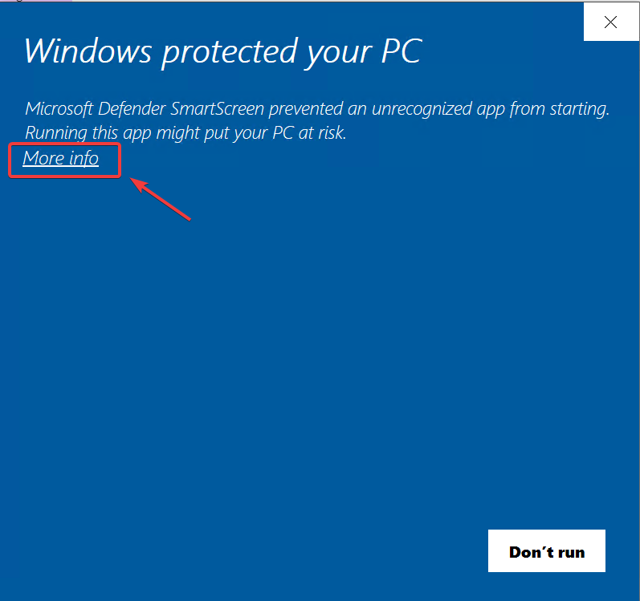
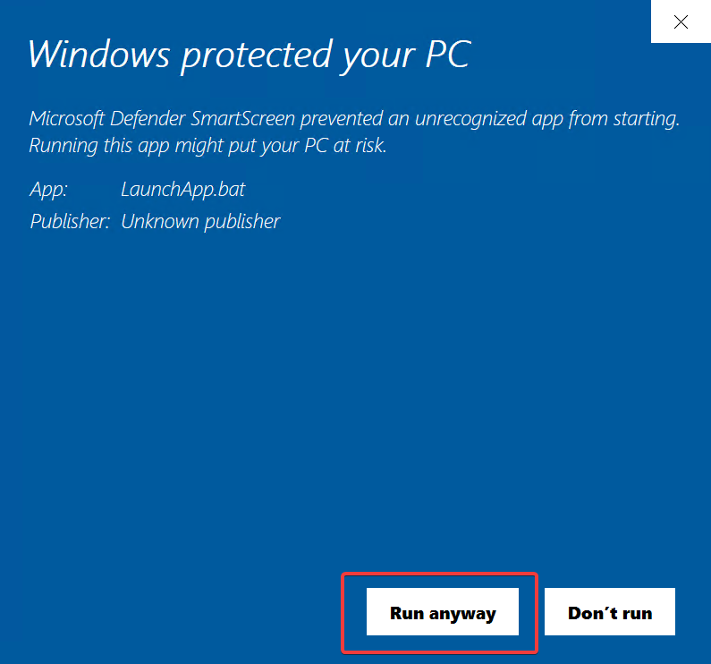

<h1> Documentation for the Meeting Summary App </h1>

<h2> Table of Contents </h2>

- [1. Getting Started Guide / Instructions of Use](#1-getting-started-guide--instructions-of-use)
  - [Launching the App](#launching-the-app)
  - [Using the App](#using-the-app)
  - [Processing \& Email Notifications](#processing--email-notifications)
- [2. Installation Guide and System Requirements](#2-installation-guide-and-system-requirements)
  - [Installation Steps](#installation-steps)
  - [System Requirements](#system-requirements)
- [3. Frequently Asked Questions (FAQ)](#3-frequently-asked-questions-faq)
  - [Common Questions](#common-questions)
- [4. Common Issues \& Solutions](#4-common-issues--solutions)
- [5. License Activation and Management Guide](#5-license-activation-and-management-guide)
  - [License Locking](#license-locking)
  - [Moving the App](#moving-the-app)
  - [Support for Licensing Issues](#support-for-licensing-issues)
- [6. Privacy \& Data Security Policy](#6-privacy--data-security-policy)
  - [Data Handling](#data-handling)
  - [Data Privacy](#data-privacy)
  - [Security Measures](#security-measures)
  - [User Consent](#user-consent)
- [7. Customer Support and Contact Information](#7-customer-support-and-contact-information)
  - [Overview](#overview)
  - [License, General Inquiries \& Technical Support](#license-general-inquiries--technical-support)
  - [Feedback](#feedback)

---
                

## 1. Getting Started Guide / Instructions of Use

### Launching the App
- Locate the `LaunchApp.bat` file in the app folder.
  
- Double-click the `LaunchApp.bat` file to launch the application in your default web browser.

**NOTE**
- If this is the first time Launching the application it will install uv to set up python environment. The script will auto close on completion. You will have to re-run the file again
- The First run of the application will take longer (~20 seconds), to set up the necessary packages. All further launches should be faster (< 2 seconds).
- If you run into "**Windows Protected Your PC**" warning, see section [4. Common Issues \& Solutions](#4-common-issues--solutions) for solution.

### Using the App
- In the opened browser window, enter the full filepath of your video or audio file.
  
- Type or paste the complete filepath and click the `Process & Upload` button.

### Processing & Email Notifications
- **Upload Confirmation:**
  - Once the file is uploaded, you will immediately receive an email confirming the successful upload.
- **Meeting Summary Email:**
  - After processing, a second email containing the meeting summary will be sent. Processing time may vary based on file size and server load.

---

## 2. Installation Guide and System Requirements

### Installation Steps
1. **Download and Extraction:**
   - Download the app folder from the provided source.
   - Extract the contents of the zip file into a dedicated folder.
2. **Launching:**
   - Ensure all files (including `LaunchApp.bat`) are present in the folder.
   - Double-click the `LaunchApp.bat` file to start the application.

### System Requirements
- **Operating System:** Windows 10 or later (both 32-bit and 64-bit supported)
- **Internet Connection:** Required for file uploads and receiving email notifications.
- **Disk Space:** Sufficient free space to temporarily store video/audio files.
- **Memory:** Recommended minimum of 2GB RAM for optimal performance.

---

## 3. Frequently Asked Questions (FAQ)

### Common Questions

**Q1: How do I start using the app?**  
**A:** Double-click the `LaunchApp.bat` file, enter the file path of your media file in the browser, and click "Submit."

**Q2: What should I do if I don’t receive any email notifications?**  
**A:**  
- Check your spam or junk email folder.
- Verify your internet connection.  
- Ensure the file was uploaded successfully (you will see an on-screen confirmation).
- If you are still experiencing issues, please reach out to the author using the contact details provided in the [Customer Support](#7-customer-support-and-contact-information) section.

**Q3: How long does the processing take?**  
**A:** The processing time depends on the file size and server load, typically taking between a few minutes to 15 minutes.

**Q4: What happens if I want to move the app to a different computer?**  
**A:** The app automatically locks to the first machine it is used on. To move the app, please contact the author to update the license.

**Q5: Is my data secure?**  
**A:** Yes, all data transfers use secure protocols, and your media file is only used for transcription and summarization before being removed from the server.

---

## 4. Common Issues & Solutions

**Issue: The app does not launch when I double-click `LaunchApp.bat`.**  
**Solution:**  
- Ensure that your antivirus or security software isn’t blocking the file.  
- Right-click on `LaunchApp.bat` and select "Run as administrator."

**Issue: I am getting a Blue "Windows Protected Your PC" warning when launching the app.**  
**Solution:**  
Windows may block applications that are not signed with a known publisher. To bypass this warning:  
1. Click **More Info** when the warning message appears.
  
2. Click the **Run Anyway** button to allow the application to launch.  
  
3. If you want to prevent this warning in the future:  
   - Right-click `LaunchApp.bat` and select **Properties**.  
   - Under the **General** tab, look for **Security** at the bottom and check **Unblock** if available.  
   - Click **Apply** and **OK** to save the changes.  
4. If your antivirus software blocks the file, add it to the trusted list or whitelist.

**Issue: I receive a "file not found" error when entering the file path.**  
**Solution:**  
- Double-check the filepath for any typos.  
- Confirm that the file exists in the specified location and that you have permission to access it.

**Issue: No email confirmation received after uploading.**  
**Solution:**  
- Check your spam/junk folder.  
- Verify your internet connection.  
- Confirm that the file was successfully uploaded based on any on-screen messages.

**Issue: The meeting summary email is delayed or not received.**  
**Solution:**  
- Allow up to 30 minutes for processing.  
- Re-check your email filters.  
- If the issue persists, refer to the support section for further assistance.

---

## 5. License Activation and Management Guide

### License Locking
- The app automatically locks the license to the first PC it is used on. No additional activation steps are required during the initial setup.

### Moving the App
- If you need to transfer the app to another computer or user, contact the author using the registered email address.
- The author will update the license on the backend to allow usage on the new system.

### Support for Licensing Issues
- For any problems related to licensing or transferring the license, please use the contact details provided in the [Customer Support](#7-customer-support-and-contact-information) section.

---

## 6. Privacy & Data Security Policy

### Data Handling
- The audio is extracted from your video/audio file and processed on a secure central server.

### Data Privacy
- Your file is used exclusively for generating transcriptions and meeting summaries.
- Once processed, your data is immediately deleted from the server.

### Security Measures
- All data transfers are encrypted.
- The server undergoes regular security audits to ensure data protection.

### User Consent
- By using the app, you consent to the processing of your data as outlined above.

---

## 7. Customer Support and Contact Information

### Overview
Details for obtaining additional help and providing feedback.

### License, General Inquiries & Technical Support
- **Email:** [meetingsummary@rpakishore.co.in](mailto:meetingsummary@rpakishore.co.in)

### Feedback
- Users are encouraged to send feedback and suggestions to help improve the app.
